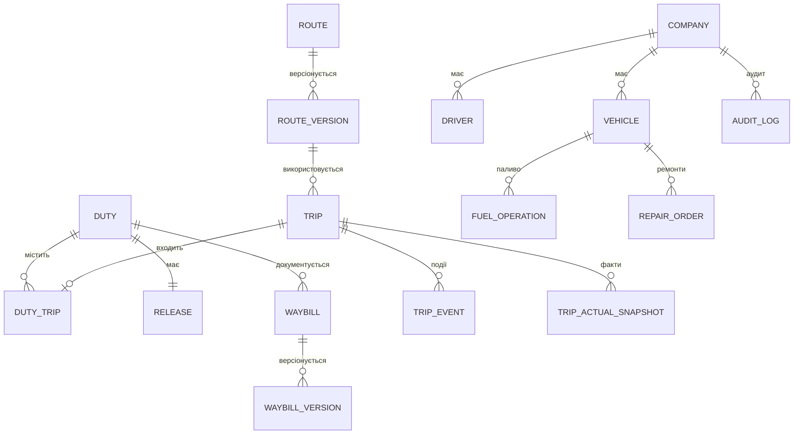

# ER-модель — логічний рівень

Ключові зв'язки:

```mermaid
erDiagram
    COMPANY ||--o{ VEHICLE : має
    COMPANY ||--o{ DRIVER : має
    ROUTE ||--o{ ROUTE_VERSION : версіонується
    ROUTE_VERSION ||--o{ TRIP : використовується
    DUTY ||--o{ DUTY_TRIP : містить
    TRIP ||--o| DUTY_TRIP : входить
    DUTY ||--|| RELEASE : має
    DUTY ||--o{ WAYBILL : документується
    WAYBILL ||--o{ WAYBILL_VERSION : версіонується
    TRIP ||--o{ TRIP_EVENT : події
    TRIP ||--o{ TRIP_ACTUAL_SNAPSHOT : факти
    VEHICLE ||--o{ FUEL_OPERATION : паливо
    VEHICLE ||--o{ REPAIR_ORDER : ремонти
    COMPANY ||--o{ AUDIT_LOG : аудит
```

Це логічна оглядова ERD. Повна фізична ERD формується під час DDL design review і повинна відповідати PostgreSQL migrations.
