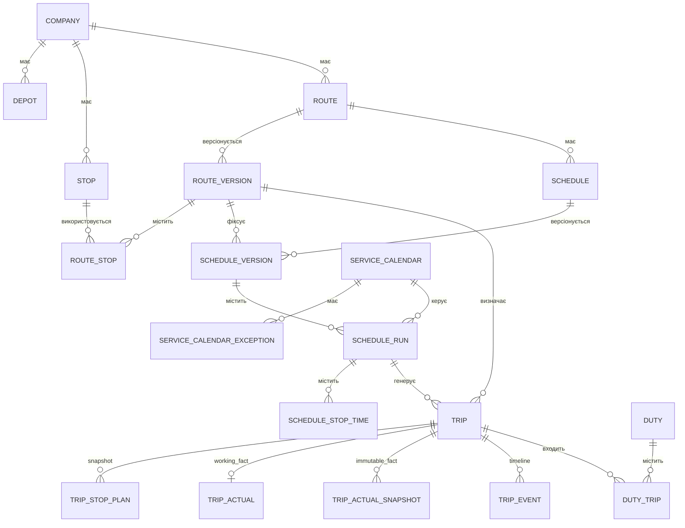
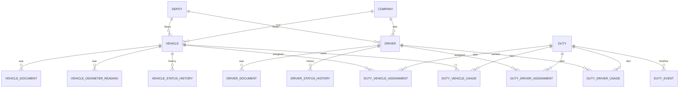
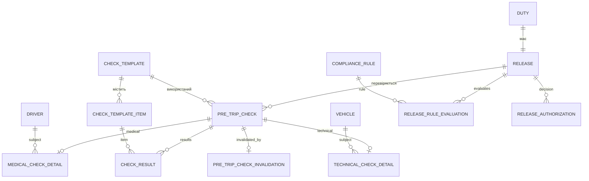
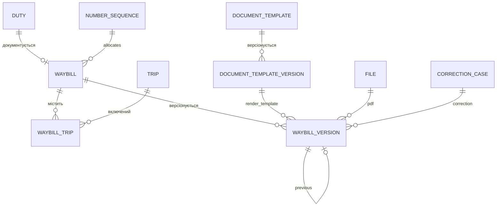
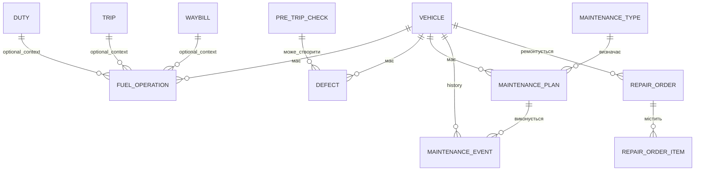
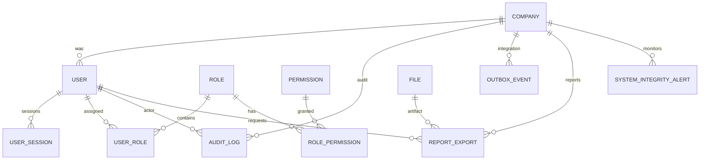

# ERD v1 — TransportERP-UA

Статус: **M0 physical design draft**

Через розмір моделі ERD розділено на доменні фрагменти. Повний перелік таблиць: [Table Catalog](Table-Catalog.md).

## 1. Planning → Trip → Duty

## 2. Fleet / Drivers → Duty assignments

## 3. Duty → Release → Checks

## 4. Duty → Waybill → immutable versions

`NUMBER_SEQUENCE → WAYBILL` є логічним зв’язком нумерації; direct FK на sequence row може бути відсутнім, якщо snapshot series/year достатній. Якщо потрібна повна provenance — додати `number_sequence_id` до `waybills` у migration review.

## 5. Fleet → Fuel / Maintenance / Repairs

## 6. Identity / Audit / System

## 7. Ключові cardinality/invariant notes

- один `Duty` містить 1..N `Trip` через `duty_trips`, але один Trip має максимум одне ACTIVE membership;
- один vehicle/driver може мати багато assignments у часі, але active periods не overlap завдяки exclusion constraint;
- один `Duty` має один `Release`;
- базова MVP policy: один чинний Waybill на Duty, але Waybill може містити багато Trips;
- completed check не переписується; invalidation окрема сутність;
- closed Trip має 1..N immutable actual snapshots, один із яких є effective;
- Waybill має 1..N immutable versions, одна current/effective;
- corrections не змінюють старі snapshot/version;
- audit та events append-only.

## 8. Polymorphic relations

Свідомо polymorphic без universal FK:

- `audit_log.entity_type/entity_id`;
- `outbox_events.aggregate_type/aggregate_id`;
- `correction_cases.entity_type/entity_id`;
- `entity_attachments.entity_type/entity_id`;
- `system_integrity_alerts.entity_type/entity_id`.

Усі вони зберігають `company_id`; domain/application layer перевіряє entity type + tenant scope. Там, де relation є критичною для integrity (Waybill PDF, Trip snapshot, release subject), використовується прямий FK.
